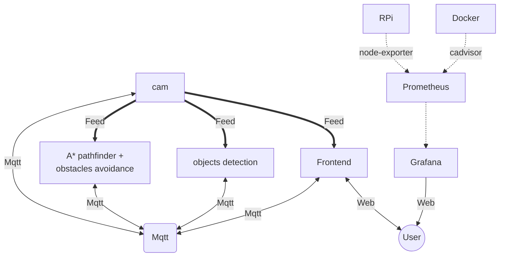

# foucault
diy self balanced personal bot

Run with `docker compose up`

## About

This is a group of docker services running on a Raspberry Pi.

containers:

- A* pathfinder + object avoidance
  Node.js + Tensorflow.js
- object detection
  Node.js + Tensorflow.js
- PID balance control
  Node.js 
- Frontend Web
  Node.js 
  web frontend for i/o communication with the world. 
- webcam stream 
  node.js

- Mqtt broker
  queue messages for internal services communications
- node-exporter
  exports RPi stats to Prometheus
- cadvisor
  monitors container resource usage and performance
- Prometheus 
  collects metrics
- grafana
  visualizes metrics

## Access services

frontend: http://foucault.local:8080
webcam-stream: http://foucault.local:3008
astar-pathfinder: http://foucault.local:3002
object-detection: http://foucault.local:3000
pid-balance: http://foucault.local:3003

Grafana: http://foucault.local:3001 (default credentials: admin/admin).
Prometheus: http://foucault.local:9090.
cAdvisor: http://foucault.local:8081/ (for real-time container stats).
Node Exporter metrics will be available to Prometheus at http://foucault.local:9100/metrics.

Configure Grafana:
Login to Grafana and add Prometheus as a data source:
URL: http://prometheus:9090
Import dashboards for Node Exporter and cAdvisor from Grafana Labs (you can search for existing dashboards like Node Exporter Full and cAdvisor).

  